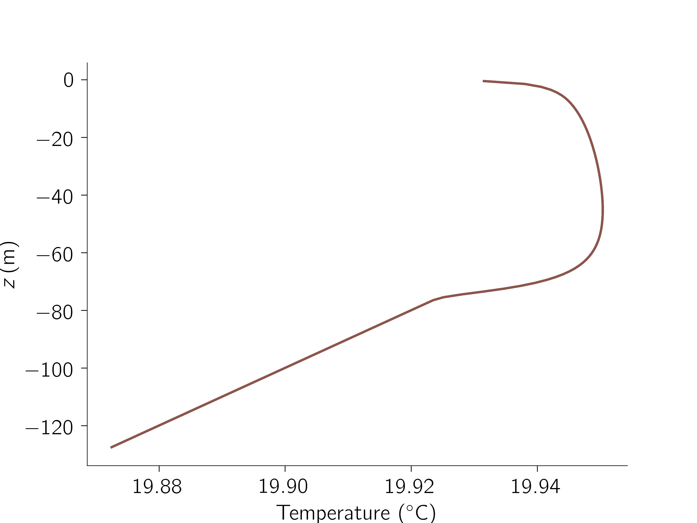

# OceanTurb.jl

| **Documentation**             | **Build Status**                    | **License** |
|:-----------------------------:|:-----------------------------------:|:-----------:|
| [![docs][docs-img]][docs-url] | [![travis][travis-img]][travis-url] |[](https://mit-license.org/)|


`OceanTurb.jl` provides software for solving one-dimensional
models that approximate the physics of the
ocean's turbulent surface boundary layer.

## Installation

Open [julia](https://julialang.org), press `]` to enter package manager mode, and type

```julia
pkg> add https://github.com/glwagner/OceanTurb.jl.git
```

## Example(s)

With `OceanTurb.jl` installed, try

```julia
using OceanTurb

@use_pyplot_utils

     N = 128
     L = 128
    Fb = 1e-7
  dTdz = 1e-3
    Δt = 10minute
tfinal = 8hour

model = KPP.Model(N=N, L=L, stepper=:BackwardEuler)
model.solution.T = T₀

model.bcs.T.top = FluxBoundaryCondition(Fb / (model.constants.α * model.constants.g))
model.bcs.T.bottom = GradientBoundaryCondition(dTdz)

run_until!(model, Δt, tfinal)

plot(model.solution.T)
removespines("top", "right")
xlabel("Temperature (\$ {}^\\circ \\mathrm{C} \$)")
ylabel(L"z \, \mathrm{(m)}")
```

to make this plot:



For a more complicated example, see `examples/modular_kpp_example.jl`
to produce


which compares various flavors of the 'KPP' boundary layer model
with one another.

Check our
[diffusion examples notebook](https://github.com/glwagner/OceanTurb.jl/blob/master/examples/diffusion_example.ipynb)
and scripts in `examples/` to get started.

# The turbulence models

Check the documentation or `src/models/` for the latest update
on turbulence models we have implemented.

# Authors

[Gregory Wagner](glwagner.github.io).


[docs-img]: https://img.shields.io/badge/docs-latest-blue.svg
[docs-url]: https://glwagner.github.io/OceanTurb.jl/latest/

[travis-img]: https://travis-ci.org/glwagner/OceanTurb.jl.svg?branch=master
[travis-url]: https://travis-ci.org/glwagner/OceanTurb.jl
